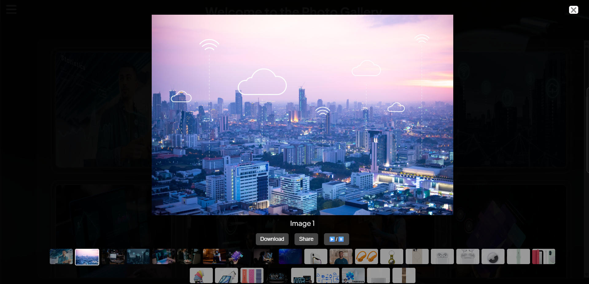

# 📷 Masonry Image Gallery

A responsive image gallery using a **masonry layout** with **modal view**. Built with HTML, CSS, and JavaScript — no external libraries required.

---

## 🚀 Features

- 🧱 Masonry-style layout (like Pinterest)
- 🖼️ Click image to open in fullscreen modal
- 🖱️ Hover zoom effect
- 🥇 Download feature With share anywhere

---

## 💡 How to Use

1. Clone or download the project
2. Replace image sources (`image1.jpg`, etc.) with your own
3. Open `index.html` in your browser

---

## 📸 Preview

.png)

---

## 🛠️ Built With

- HTML5
- CSS3 (Flexbox & CSS columns)
- JavaScript

## 📄 License

Free to use for personal and commercial projects.

---

## 🙌 Author

Made by **Jaykant Yadav**